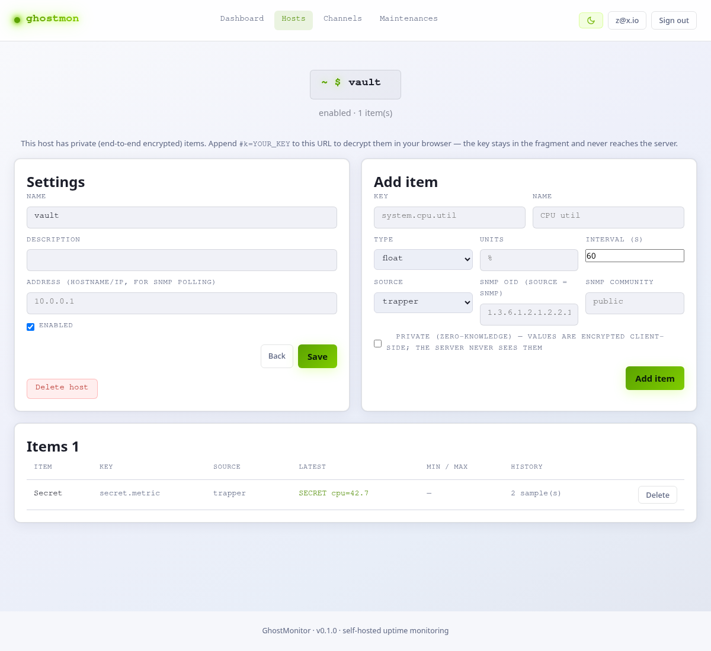
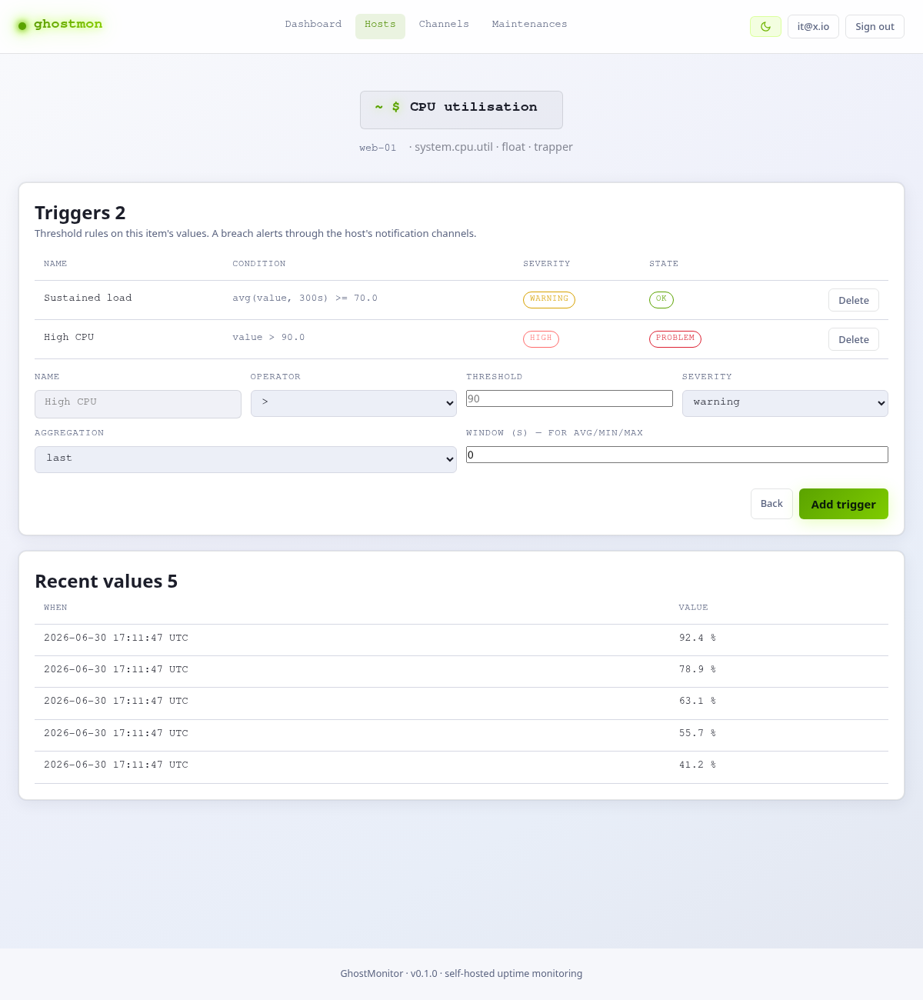
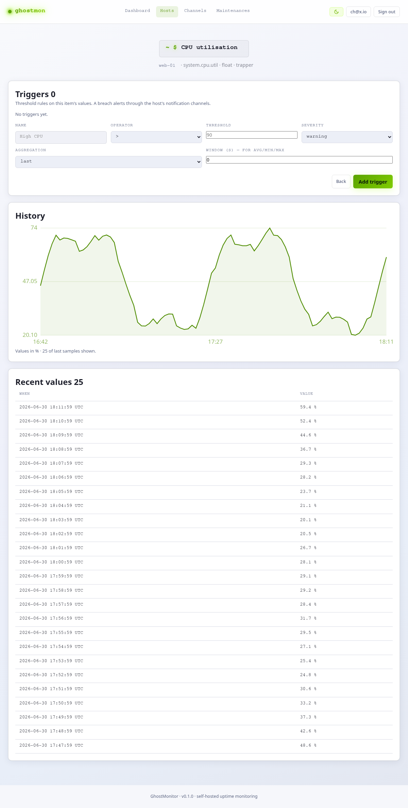
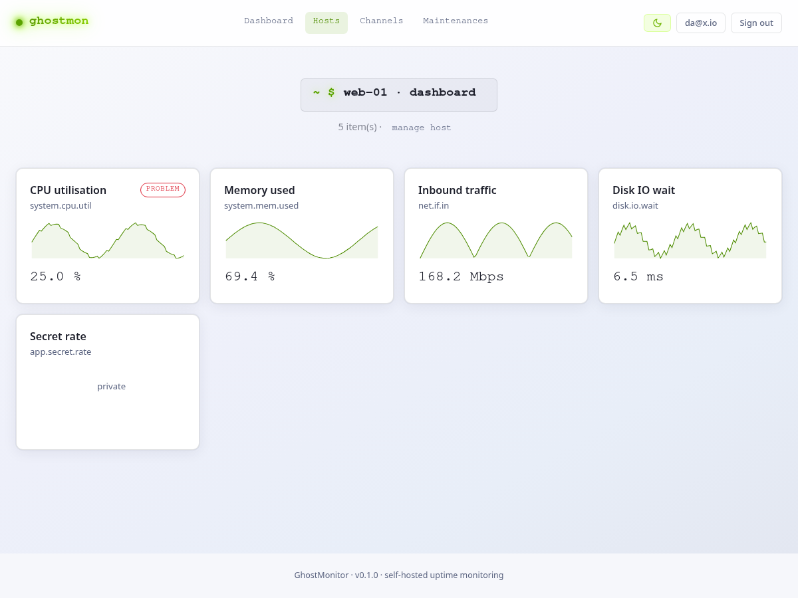
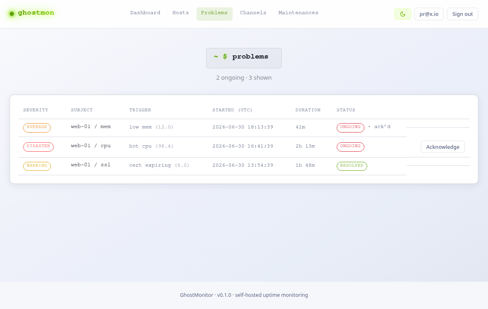
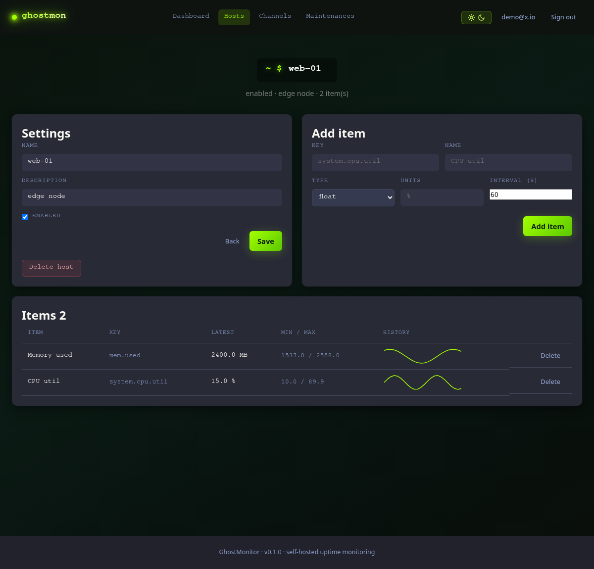
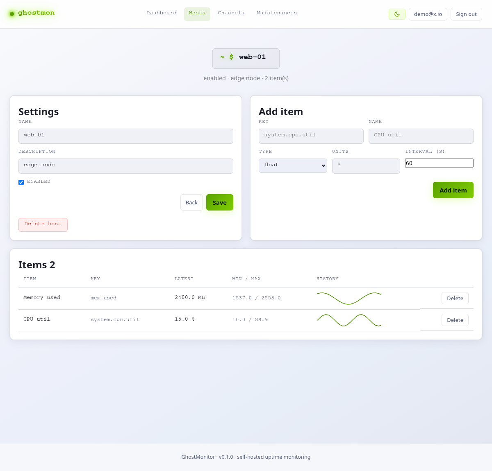
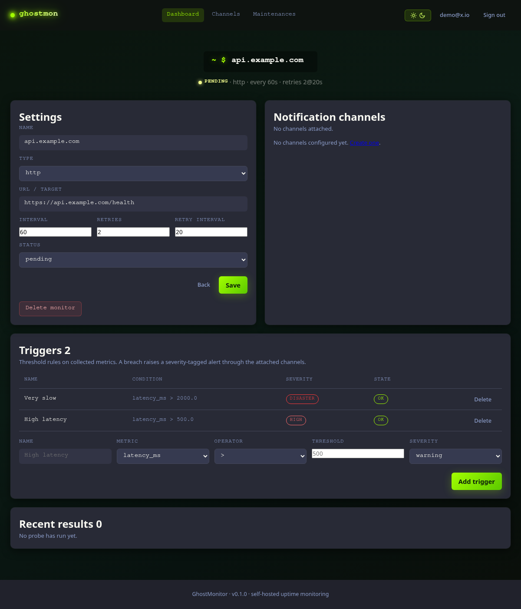
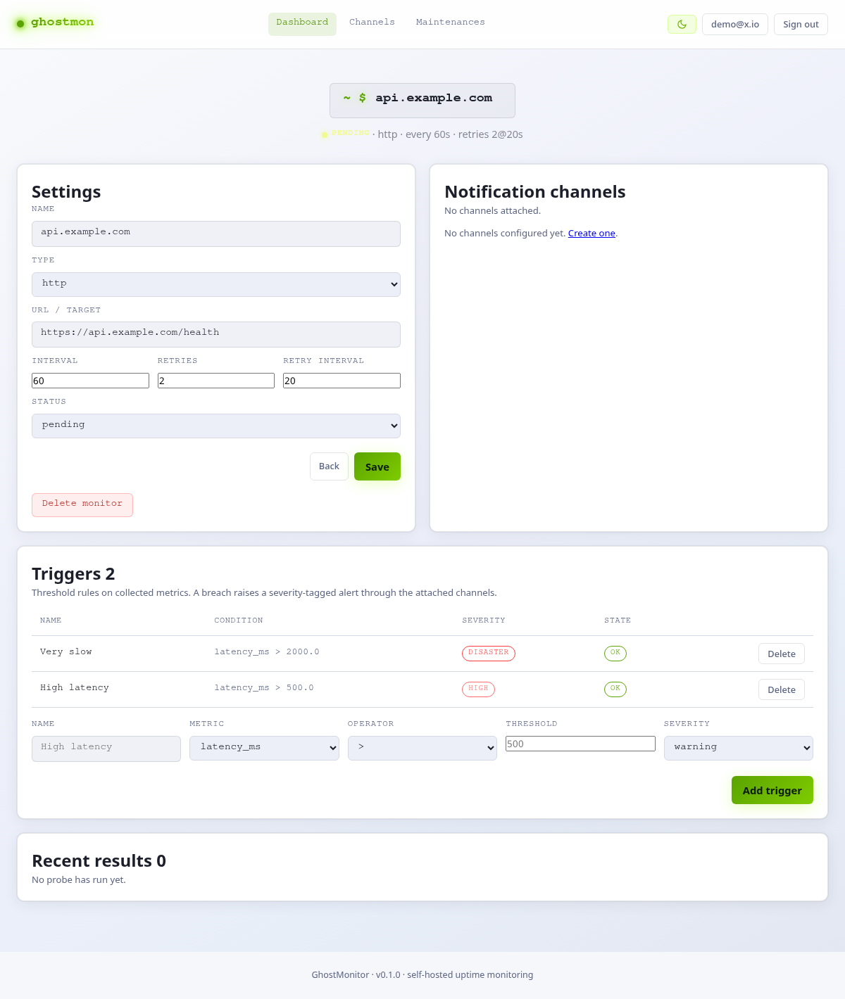

<h1 align="center">GhostMonitor</h1>

<p align="center">
  Self-hosted infrastructure monitoring — a <strong>privacy-first</strong> alternative to Zabbix.<br>
  Your monitoring secrets and alert targets are encrypted at rest; private metrics are end-to-end encrypted, so the server can <strong>never</strong> read them.
</p>

<p align="center">
  <a href="docs/roadmap.md">Roadmap</a>
  &nbsp;·&nbsp;
  <a href="docs/adr/0001-target-architecture-zabbix-alternative.md">Architecture (ADR)</a>
  &nbsp;·&nbsp;
  <a href="#self-hosting">Self-hosting</a>
  &nbsp;·&nbsp;
  <a href="#privacy-the-differentiator">Privacy</a>
</p>

<p align="center">
  <a href="https://github.com/stackopshq/ghostmon/actions/workflows/ci.yml"></a>
  
  
  
  
  
  
</p>

---

> **Project status — v0.1.** GhostMonitor is a capable agentless **uptime monitor**
> today, growing toward full Zabbix-style monitoring (hosts, metric items, history,
> trends, triggers, templates, agent/SNMP collection). It probes endpoints on a
> schedule (HTTP, TCP, SSL expiry, ICMP ping, SNMP), records latency/availability
> history with trend rollups, and alerts over email/webhook on **UP ↔ DOWN** and on
> metric thresholds. JSON API + server-rendered web UI + Prometheus metrics.

## Privacy — the differentiator

A plain Zabbix clone has no reason to exist. GhostMonitor's reason is **privacy**, in
the spirit of the [ghost suite](https://ghostbit.dev). Two layers:

**1. Encryption at rest.** Monitoring secrets (webhook signing secrets, SNMP
communities) and **alert targets** (webhook URLs, email recipients) are
Fernet/AES-encrypted with a key derived from `APP_SECRET_KEY`. A stolen database dump
reveals no credentials and not even *where* alerts go or *who* is notified.

**2. Zero-knowledge private items.** An item flagged *private* stores only
client-encrypted ciphertext (AES-256-GCM). The server never decrypts or evaluates it;
the key is **never** transmitted. Decryption happens in your browser, with the key in
the URL fragment or derived from a passphrase — exactly the ghostbit model.

```
https://ghostmon.example.com/hosts/<id>#k=KEY
                                        ↑
                              never sent to the server
```

| Private-item mode | Key source | Where the key lives |
|---|---|---|
| Random key | `crypto.subtle.generateKey()` | URL `#fragment` |
| Passphrase | Argon2id (ghostbit params) | your memory |

The CLI is interoperable with the browser: `ghostmon zk encrypt --key … | --password …`.

## Screenshots

**Zero-knowledge private item** — encrypted client-side; the server only ever holds
ciphertext, and the browser decrypts it with a URL-fragment key or an Argon2id
passphrase that never reaches the server:



**Item detail** — threshold triggers on a metric item (alerting through the host's
channels) with severity/state pills, a server-rendered history chart, hourly trend
rollups, and recent values:



**Time-series history** — a server-rendered SVG line chart (no JavaScript, no chart
library) over an item's history:



**Host dashboard** — an at-a-glance grid of a host's items, each with a mini-chart,
current value, and trigger status:



**Problems timeline** — ongoing and resolved problem events (trigger state changes)
with severity, duration, and one-click acknowledge:



**Host detail** — items with min/max and server-rendered history sparklines:

| Dark | Light |
| --- | --- |
|  |  |

**Monitor detail** — settings, notification channels, and threshold triggers:

| Dark | Light |
| --- | --- |
|  |  |

## Features

- **Monitor types** — HTTP(S), TCP connect, SSL/TLS certificate expiry, ICMP ping, SNMP reachability (SNMPv2c).
- **Hosts, items & history** — collect arbitrary metrics as items with append-only time-series history and inline sparklines; each monitor's latency/status/error is mirrored into this model automatically.
- **Trends** — hourly min/avg/max rollups downsample numeric history so long-range data survives raw-sample retention.
- **Triggers & severities** — threshold rules (`info`→`disaster`) on monitor *or* item metrics, with a problem/OK state machine; item triggers alert through the host's channels.
- **Server-side collection** — items have a `source` (trapper / SNMP); the scheduler polls due SNMP items (any OID) from the host's address.
- **Agent ingestion** — per-owner ingest tokens and a token-authenticated `POST /api/ingest`; a dependency-free agent (`ghostmon agent run`) reports system metrics from `/proc`.
- **Notifications** — email (SMTP) and webhooks, attached per monitor or host, **severity-routed**, and fire-and-forget so a slow SMTP server never stalls probing.
- **Privacy** — encryption at rest for secrets *and* alert targets; zero-knowledge private items; no telemetry, no third-party calls, hashed ingest tokens, bounded retention.
- **Maintenance windows** — one-shot or recurring (`cron`) alert silencing.
- **Auth** — local accounts (argon2, JWT) and **OIDC SSO** (any OpenID Connect
  provider) on top, sharing the same session; SSO-only accounts need no password.
- **Interfaces** — REST API (`/api`, OpenAPI at `/docs`), web UI, a `ghostmon` CLI, Prometheus metrics (`/metrics`), liveness/readiness (`/healthz`, `/readyz`).

Stack: Python 3.12 · FastAPI · SQLAlchemy 2 (async) + asyncpg · PostgreSQL · APScheduler · Typer · Jinja2. Dependencies managed with [`uv`](https://docs.astral.sh/uv/). Containers built and run with **Podman**.

## Self-hosting

### Quickstart (Podman Compose)

```bash
git clone https://github.com/stackopshq/ghostmon
cd ghostmon
cp .env.example .env                       # then set APP_SECRET_KEY (>= 16 chars)
APP_SECRET_KEY=$(openssl rand -hex 32) podman compose up --build
```

This brings up PostgreSQL, the API (with the in-process scheduler) and Prometheus.
Useful endpoints: `/` (web UI), `/docs` (API), `/healthz`, `/readyz`, `/metrics`.

### From source

```bash
uv sync --extra dev                        # install into .venv
uv run alembic upgrade head                # apply migrations
uv run ghostmon user create -e you@example.com -s   # create a superuser
uv run uvicorn app.api.main:app --reload   # API + scheduler on :8000
```

### Podman Quadlet (rootless systemd)

Create `~/.config/containers/systemd/ghostmon.container`:

```ini
[Unit]
Description=GhostMonitor
After=network-online.target

[Container]
Image=ghcr.io/stackopshq/ghostmon:latest
PublishPort=8000:8000
Environment=APP_ENV=production
Secret=ghostmon_secret_key,type=env,target=APP_SECRET_KEY
Environment=DATABASE_URL=postgresql+asyncpg://ghostmon:ghostmon@db:5432/ghostmon

HealthCmd=python -c "import urllib.request,sys; sys.exit(0 if urllib.request.urlopen('http://127.0.0.1:8000/readyz').status==200 else 1)"
HealthInterval=30s
HealthStartPeriod=15s

[Service]
Restart=always

[Install]
WantedBy=default.target
```

```bash
podman secret create ghostmon_secret_key - <<<"$(openssl rand -hex 32)"
systemctl --user daemon-reload
systemctl --user enable --now ghostmon
```

Run `uv run alembic upgrade head` against the target database before each new release.

### Configuration

12-factor: all configuration via environment variables, validated at startup
(fail-fast). `APP_SECRET_KEY` is required (≥ 16 chars). See [`.env.example`](.env.example).

| Variable | Default | Description |
|----------|---------|-------------|
| `APP_SECRET_KEY` | — | **Required**, ≥ 16 chars. Signs JWTs and derives the at-rest encryption key. |
| `DATABASE_URL` | `postgresql+asyncpg://…/ghostmon` | Async PostgreSQL DSN. |
| `APP_ENV` | `development` | `development` or `production`. |
| `PUBLIC_BASE_URL` | `http://localhost:8000` | Base URL used in alert links. |
| `HISTORY_RETENTION_DAYS` | `30` | Prune raw samples/results older than this (0 = keep all). |
| `TRENDS_RETENTION_DAYS` | `365` | Retention for hourly trend rollups. |
| `SMTP_HOST` | — | SMTP server for email channels (empty disables email delivery). |
| `OIDC_ENABLED` | `false` | Enable OIDC login (`OIDC_ISSUER`, `OIDC_CLIENT_ID`, …). |

## CLI & agent

```bash
uv run ghostmon user create -e a@b.c -s        # create a superuser
uv run ghostmon zk genkey                      # zero-knowledge key for private items
uv run ghostmon zk encrypt --password "my passphrase" "secret value"
GHOSTMON_INGEST_TOKEN=gmi_… uv run ghostmon agent run --host web-01 --url http://localhost:8000
```

## Development

```bash
uv run ruff format .            # format
uv run ruff check .             # lint
uv run mypy app                 # strict type-check
uv run pytest                   # full suite (needs a live PostgreSQL — see below)
```

Tests run against a **real PostgreSQL** (the schema uses Postgres-specific types),
not SQLite. Bring one up first:

```bash
podman run --rm -d --name ghostmon-test-pg \
  -e POSTGRES_USER=ghostmon -e POSTGRES_PASSWORD=ghostmon -e POSTGRES_DB=ghostmon_test \
  -p 5432:5432 docker.io/library/postgres:16-alpine
```

## Architecture

Layered, with dependencies pointing inward toward `app/core`:

| Layer | Path | Responsibility |
| --- | --- | --- |
| Domain & infra | `app/core/` | ORM models, Pydantic schemas, service classes, security, DB session |
| HTTP | `app/api/` | FastAPI app factory, REST routes (`/api`), server-rendered web UI |
| Background | `app/tasks/` | Probe scheduler, probes, SNMP poller, trend rollups, notification dispatch |
| CLI / agent | `app/cli/`, `app/agent/` | Typer admin commands and the metric-push agent |

The scheduler runs **in-process** with the API. A reconcile job (every 15s) diffs the
monitors in the database against the live APScheduler jobs and converges them — the
database is the single source of truth. See [ADR 0001](docs/adr/0001-target-architecture-zabbix-alternative.md)
for the target architecture and `CLAUDE.md` for a deeper walkthrough.

## License

Released under the [MIT License](LICENSE). Copyright (c) 2026 StackOps HQ.
